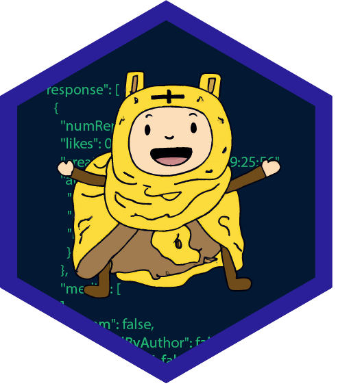

<!-- README.md is generated from README.Rmd. Please edit that file -->

```{r, include = FALSE}
knitr::opts_chunk$set(
  collapse = TRUE,
  comment = "#>",
  fig.path = "man/figures/README-",
  out.width = "100%"
)
```

# fleece 

<!-- badges: start -->
<!-- badges: end -->

"fleece" contains helper functions for turing JSON output into tidy data.frames. 
It automatically unnests all columns, deals with entries of unequal length, and notices if data is on a single or multiple observations.


## Installation

You can install the development version of fleece from [GitHub](https://github.com/) with:

``` r
# install.packages("devtools")
devtools::install_github("thieled/fleece")
```

## Example

Here are two examples how to use fleece::rectangularize() on JSON output from different APIs.  

```{r example}

library(fleece)

### Example 1

# In the first example we use the "earthquake.usgs.gov" API to get data about some earthquakes:
url <- "https://earthquake.usgs.gov/fdsnws/event/1/query?format=geojson&starttime=2023-03-01&endtime=2023-03-02&minmagnitude=5"

# Call the API and extract the content using httr
con <- httr::GET(url) |> httr::content()

# Note that httr::content already parses the JSON data into a "list" R-object.
# Often, APIs return a number of things. Pick the content that interests you:
con <- con$features

# Feed the list object into rectangularize() and voila:
df <- rectangularize(con)

dplyr::glimpse(df)


### Example 2

# Let's get some information about German universities:
url_2 <- "http://universities.hipolabs.com/search?country=Germany"

# Let's use this example to demonstrate how to deal with JSON data that is plain text:
con_2 <- httr::GET(url_2) |> httr::content(as = "text", encoding = "UTF-8") 

# Use jsonlite::parse_json() to parse text as an R 'list' object:
con_2 <- con_2 |> jsonlite::parse_json()

# Here, we can use the output right away for rectangularize():
df_2 <- rectangularize(con_2)

dplyr::glimpse(df_2)

```

## Acknowledgement

Writing documentation was accelerated by [ChatGPT](https://chat.openai.com/).  
The Adventure-Time like drawing in the logo was created by [Dall-E](https://openai.com/dall-e-2).  
The name is a [pun](https://en.wikipedia.org/wiki/Golden_Fleece). 
